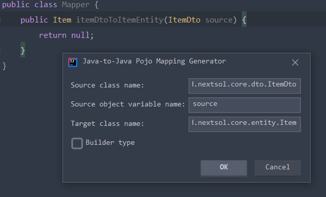
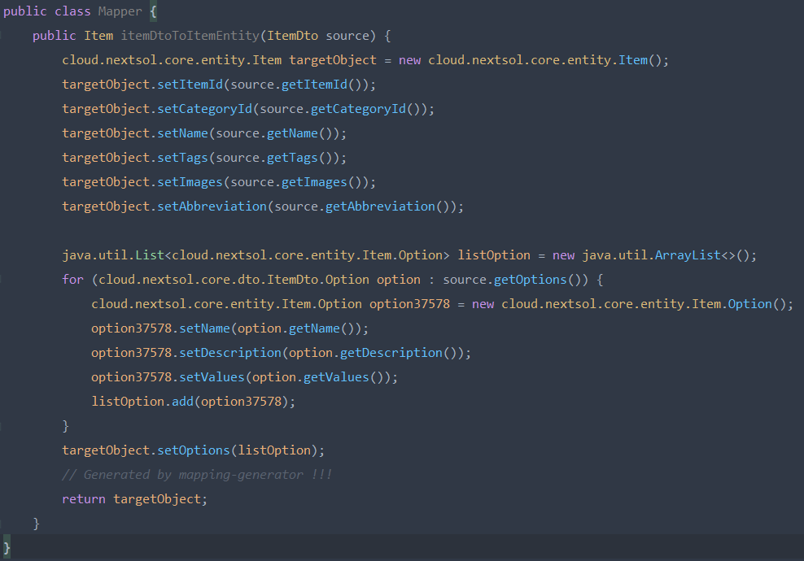
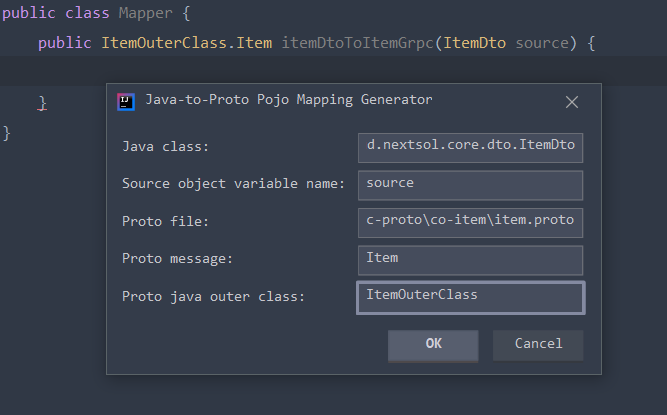
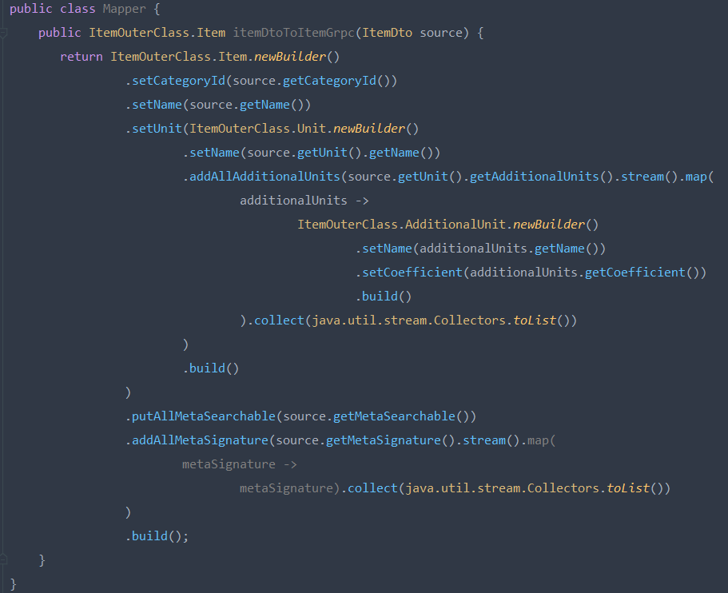
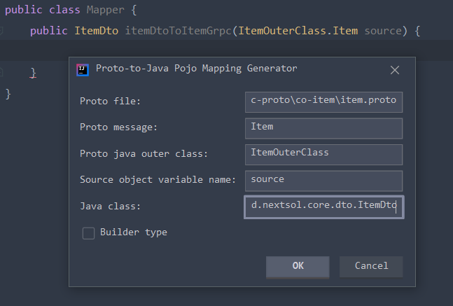
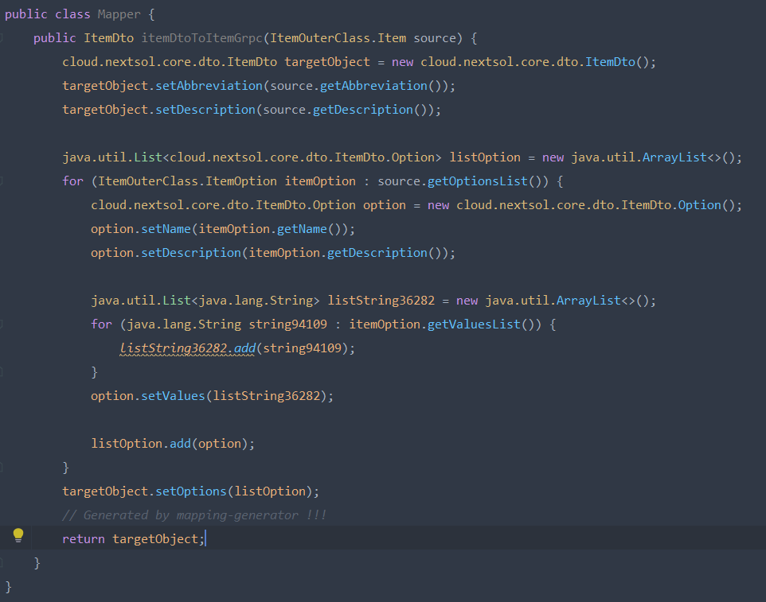
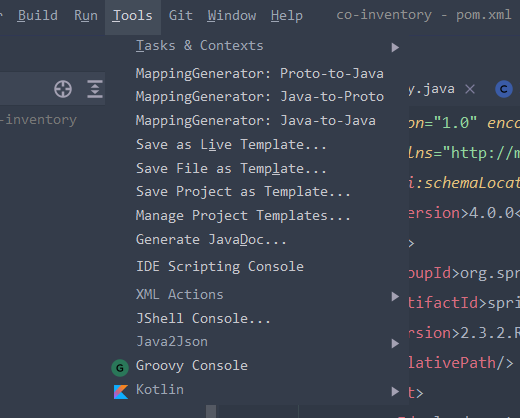

# Mapping-generator-intellij-plugin

## Main features:

1. ###### Java to Java (support both _normal_ type and _lombok builder_ type)

<br />
<br />

2. ###### Java to Proto (java class generated from proto is _builder_ type by default)

<br />
<br />

3. ###### Proto to Java (support both _normal_ type and _lombok builder_ type)

<br />
<br />

## Supported IDEs:

* Intellij IDEA Ultimate/Community/Educational.
* Android Studio.

## Intellij marketplace url:

* https://plugins.jetbrains.com/plugin/16237-mappinggenerator

## How to use:

1. ###### Install the plugin into Intellij.
2. ###### Open _Tools_ menu:

<br />

3. ###### Proto to Java:

    * ```Proto file```: your proto file name.
    * ```Proto message```: proto qualified message name.
    * ```Proto java outer class```: java outer class of the proto.
    * ```Source object variable name```: variable from the source class declaration.
    * ```Java class```: target class qualified name.
    * ```Is Builder Type```: if selected, mapping code will be generated in _builder_ style.

4. ###### Java to Proto:

    * ```Java class```: source class qualified name.
    * ```Source object variable name```: variable from the source class declaration.
    * ```Proto file```: your proto file name.
    * ```Proto message:```: proto qualified message name.
    * ```Proto java outer class```: java outer class of the proto.

5. ###### Java to Java:

    * ```Source class name```: source class qualified name.
    * ```Source object variable name```: variable from the source class declaration.
    * ```Target class name```: target class qualified name.
    * ```Is Builder Type```: if selected, mapping code will be generated in _builder_ style.

## Further development:
   * Please request if you find any bug or need more features.
